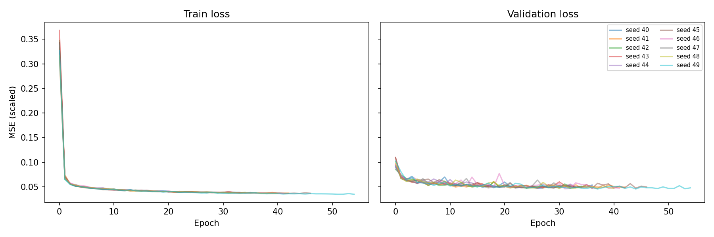
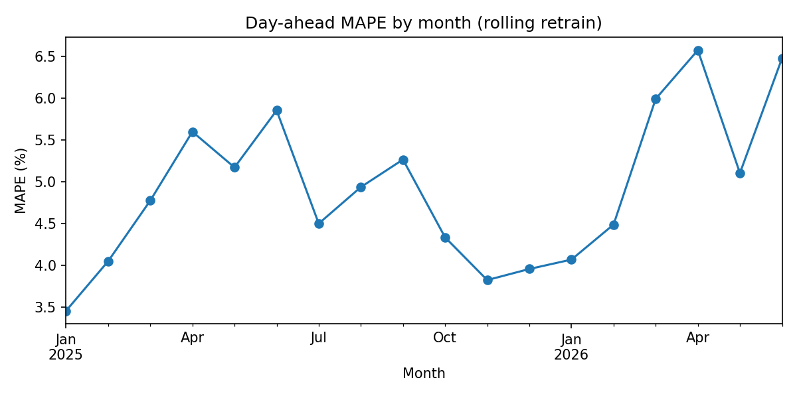
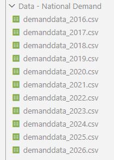

# LSTM Neural Network Modelling: Prediction of National Electricity Demand

## Overview

This project produces day ahead forecasting of British national power demand (ND), with half-hourly period. There are 5 models developed to achieve this, and a results document produced by the script outputting their success;  comparing 2 naive (day and week ahead inference), a linear regressive, a gradient boosted and a Long Short-Term Memory (LSTM) neural network model.

Briefly, 2 models were highly successful; the gradient boosted decision tree model and the LSTM neural network model both achieved similar results, at 5.4% and 5.2% average error on a prediction respectively, and both with an RMSE of ~1777, or 4-10% of a typical prediction. These models' predictive capabilities approach the magnitude of the buffer the NESO operate at. Further discussion on model outcomes is contained in this document below, though the technicalities of the National Grid and the countries pwoer demand are not addressed in any depth.

### Day-ahead predictions

Predicting demand accurately necessarily requires forecasting with a cut-off period; for example, it's no use knowing that in 30 minutes the temperature is far higher than normal - practically, national power demand requires time in advance predictions, hence the naive models are informed by day previous and week previous results, which are genuinely informative.

### Feature Engineering on limited data

Predictive features are complex, with some explicitly addressable as features i.e. holidays, temperature, but contained within the national demand are data with confounded variables that tell many different stories. For example, the daily demand increase due to TV soap use. The intrinsic features can't be unconfounded. One feature that can be coaxed manually is the temperature point of heating being switched on.

### Methodology

-Data used to train was never allowed to be used less than a day before a prediction, to avoid data leakage.
-Since power demand is a continuous feature, training data is never discontinuous; that is to say, training, validation, and test splits have explicit boundaries. 2016-2023 are always used as training data, and 2024 as too unless validation is present in the model. 2025 is testing data, and 2026 data is incomplete, but used in the rolling back test gradient boost modelling.
-The metrics used to measure the models performance are MAPE/Error %, and RMS. The former is a measure of the proportion of difference between prediction and test value by test value. RMS (root mean squared) has its standard meaning, and loosely is a measure of how consistent predictions are close to actual values.
-Models are trained on measured weather, and so the practical implication of using forecasting is still to be tested. Forecasting is notoriously fickle in the United Kingdom. Data will be collected for forecasts in due course.

## Data

Open Meteo have provided the weather data for training, and the National Energy System Operator (NESO) have provided the national demand data for training. Holiday data sourced from "holidays" package from Vacanza. None of which are in association with this project, and full acknowledgements of licence use are made at the bottom of this page.

### Data Quality

-National Demand data is inconsistently formatted, and has an outage in May of this year.
-Clocks changing breaks lagged features for some models resulting in 2 days per year with incorrect periods.

Weather is based on one location, and as power demand is heavily related to (but not entirely driven by) population density, the location of Appleba Parve in England was selected, which according to wikipedia is roughly the population centre by mean least squares method. https://en.wikipedia.org/wiki/Centre_points_of_the_United_Kingdom

Selecting one point to use to assist in prediction of the entire countries demand is not going to give the most that weather has to give in predicting demand, however an average by various locations could dampen significant affectors (snow is often localised, but the average temperature between locations may be much higher, even though snow increases power demand it's effect may be lost through aggregation). That being said, the data released does not have regional resolution, and short of constructing mapping of population density to the model, a single point is the highest resolution possible.

## The Models

Roughly, the complexity with which the problem is addressed in order with
1. Naive
2. Linear Regression
3. XGBoost
4. LSTM neural network

Changes needed to data before use in each model are made inline, as is feature engineering.

Naive: 2 models, based only on the previous week and previous day. 
Linear: based on day lagged information, cloud cover, temperature and heating point features, and priodicity of day-night cycle and yearly cycle 
XGBoost: based on the same as before, except capable of accounting for day of week and time of day 
LSTM neural net: dropped daily periodicity and the encoded previous day/week data which confuses a model which has knowledge over time 

These are ran sequentially, and a results folder outputs a summary evaluation of the models. A technical discussion of how each model functions mathematically is not held here.

## Results

### Model Comparison for success in predicting national power demand for the year 2025

As a final model, the neural network was successful at predicting accurately and precisely based on the data made available to it, with approximately 30% improvement on the naive daily model in Error % and approximately a 40% lower RMS.

### LSTM nn results

We see that the model trains for around 50 epochs before hitting the stopping conditions, where validation and train loss stop improving. Successful tapering to a minimum in a similar curve are a good signal that the model has generalised well, and has not overfit on any of the data.

Different seeds for the neural network have different outcomes. Acknowledged due to the breadth of results depending on seed being of similar magnitude to the improvements to the models themselves. We see that each seed has similar results for both Error % and RMS with no outliers.

### Grad boosted: retraining from different origins

Interestingly, Spring was the least accurate. Weather is highly unpredictable during the spring seasons.

### Conclusion

With each iteration of model, improvements were made, which is reflected for the most part in (model_summary.csv), though it is worth noting that that grad boosted model occasionally outperforms the LSTM neural network in accuracy and precision, and in terms of compute is a much more reasonable option. That being said, there are not a great deal of features engineered in the model, which may mean that the LSTM model can see further improvements. Additionally, we see that the LSTM model generalises well according to our graphed loss.

## Error Analysis

Discussing potential reasons that the XGBoost model struggled on the 10 most incorrect prediction days of 2025 (XGB_Top_Outliers.csv):

1. 25/5/25: The next day was a bank holiday Monday
2. 5/8/25: 11.6 is cold for the beginning of August in southern England, the HDD feature kicks in at 16 which would be more usual for August.
3. 25/8/25: Summer bank holiday
4. 16/4/25: Another potential temperature anomoly
5. 27/4/25: The London Marathon was apparently on this day, hard to comment on the effect this would have had, but it being a Sunday too means people may have been staying in, or other people out.
6.31.8.25: Cannot find a good reason, it may be confounded variables i.e. broader national weather, events, that are not interesting enough to report on and are not present in our data.
7. 27.11.25: Higher than average temperature for the time of year, potentially Black Friday comes into this as well.
8. 7.7.25: 12 degrees in early July, just a cold day likely.
9. 26.6.25: Festivals were all on that weekend, otherwise the features seem normal.
10. 4.10.25: Unremarkable day in the news, potentially just cold again.

Interestingly, only one naitonal holiday was aberative from the predictions. Low temperatures were missed here more than anything that could be picked up from quick news searches or other features; it is possible the model has not appreciated the HDD feature sufficiently.

## Rolling-Origin Backtest

Using the XGBoost model set to move forward and include months back into training to predict the next month, the detail in (rolling_monthly_results.csv) is produced.

Interesting to note is that there was no noteable change in performance by expanding the training window

## Source and Licensing

Data sourced from the National Energy System Operator is licenced under the "NESO Open Licence" which allows the distribution of the historical demand data, though non has been shared in this repo. Full licence description available: https://www.neso.energy/data-portal/neso-open-licence

Data sourced from Open Meteo is an open data initiative licenced under Attribution 4.0 International (CC BY 4.0) and all weather data in this project is from, and made avaialble by Open Meteo.com. Full Licence description available: https://github.com/open-meteo/open-meteo/blob/main/LICENSE

Holiday data is under MIT license, Author: Vacanza Team. Maintained by: Arkadii Yakovets, Panpakorn Siripanich, Serhii Murza https://github.com/vacanza/holidays?tab=MIT-1-ov-file

Pipeline code released under MIT license.

### Full acknowledgement of the Open Meteo team whose work was invaluable to this project.

Zippenfenig, P. (2023). Open-Meteo.com Weather API [Computer software]. Zenodo. https://doi.org/10.5281/ZENODO.7970649

Hersbach, H., Bell, B., Berrisford, P., Biavati, G., Horányi, A., Muñoz Sabater, J., Nicolas, J., Peubey, C., Radu, R., Rozum, I., Schepers, D., Simmons, A., Soci, C., Dee, D., Thépaut, J-N. (2023). ERA5 hourly data on single levels from 1940 to present [Data set]. ECMWF. https://doi.org/10.24381/cds.adbb2d47

Muñoz Sabater, J. (2019). ERA5-Land hourly data from 2001 to present [Data set]. ECMWF. https://doi.org/10.24381/CDS.E2161BAC

Schimanke S., Ridal M., Le Moigne P., Berggren L., Undén P., Randriamampianina R., Andrea U., Bazile E., Bertelsen A., Brousseau P., Dahlgren P., Edvinsson L., El Said A., Glinton M., Hopsch S., Isaksson L., Mladek R., Olsson E., Verrelle A., Wang Z.Q. (2021). CERRA sub-daily regional reanalysis data for Europe on single levels from 1984 to present [Data set]. ECMWF. https://doi.org/10.24381/CDS.622A565A

## How to run

1. Install requirements from requirements.txt (`pip install -r requirements.txt`)
2. Visit "https://www.neso.energy/data-portal/historic-demand-data" and download "Historic Demand Data YYY" for 2016-2026 inclusive. This is the data that will be added to the "Data - National Demand" folder. Ensure each of those files is named with format "demanddata_YYY.csv".

3. Run `main.py`
4. If the demanddata has not been added, answer no and the program will terminate, you may then add the historic demand data files to the "Data - National Demand" folder.
5. Download weather y/n, if you have not previously downloaded any data then select y, otherwise y only when requesting an update.
6. Finished

What is produced?
This will update the README charts, and the results CSVs which the readme explains the results of. The snippets of the CSVs present in the README will not be updated however so consult the files themselves, that is "allresults" and "LSTM_seeds" that do not update within the README.

A file called "best.pt" will appear in the directory. This contains the weights of the best of the 10 pytorch neural networks, and can be loaded back and used on other data. Currently this will require manual code adaptation.

## WIP

Funcitonality for adding forecast data, and a proper UI is planned but yet to begin development, to allow daily demand prediction based on the forecast for the week ahead.

Instructions for preparing data for use with the "best.pt" model are to be produced.