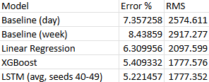
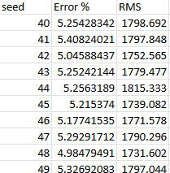
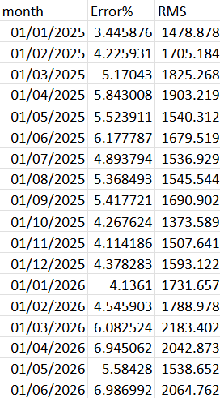

# LSTM Neural Network Modelling: Prediction of National Electricity Demand

## Overview

This project produces day ahead forecasting of British national power demand (ND), with half-hourly period. There are 5 models developed to achieve this, and a results document produced by the script outputting their success;  comparing 2 naive (day and week ahead inference), a linear regressive, a gradient boosted and a Long Short-Term Memory (LSTM) neural network model.

### Day-ahead predictions

Predicting demand accurately necessarily requires forecasting with a cut-off period; for example, it's no use knowing that in 30 minutes the temperature is far higher than normal - practically, national power demand requires time in advance predictions, hence the naive models are informed by day previous and week previous results, which are genuinely informative.

### Feature Engineering on limited data

Predictive features are complex, with some explicitly addressable as features i.e. holidays, temperature, but contained within the national demand are data with confounded variables that tell many different stories. For example, the daily demand increase due to TV soap use. The intrinsic features can't be unconfounded. One feature that can be coaxed manually is the temperature point of heating being switched on.

##

## Data

Open Meteo have provided the weather data for training, and the National Energy System Operator (NESO) have provided the national demand data for training. Holiday data sourced from "holidays" package from Vacanza. None of which are in association with this project, and full acknowledgements of licence use are made at the bottom of this page.

### Data Quality

National Demand data is inconsistently formatted, and has an outage in May of this year.

Weather is based on one location, and as power demand is heavily related to (but not entirely driven by) population density, the location of Appleby Parve in England was selected, which according to wikipedia is roughly the population centre by mean least squares method. https://en.wikipedia.org/wiki/Centre_points_of_the_United_Kingdom

Selecting one point to use to assist in prediction of the entire countries demand is not going to give the most that weather has to give in predicting demand, however an average by various locations could dampen significant affectors (snow is often localised, but the average temperature between locations may be much higher, even though snow increases power demand it's effect may be lost through aggregation). That being said, the data released does not have regional resolution, and short of constructing mapping of population density to the model, a single point is the highest resolution possible.

## The Models

Roughly, the complexity with which the problem is addressed in order with
1. Naive
2. Linear Regression
3. XGBoost
4. LSTM neural network

Changes needed to data before use in each model are made inline, as is feature engineering.

Naive: 2 models, based only on the previous week and previous day.
Linear: based on day lagged information, cloud cover, temperature and heating point features, and priodicity of day-night cycle and yearly cycle
XGBoost: based on the same as before, except capable of accounting for day of week and time of day
LSTM neural net: dropped daily periodicity and the encoded previous day/week data which confuses a model which has knowledge over time

These are ran sequentially, and a results folder outputs a summary evaluation of the models. A technical discussion of how each model functions mathematically is not held here.

## Results

### Model Comparison for success in predicting national power demand for the year 2025

As a final model, the neural network was the most successful at predicting accurately and precisely based on the data made available to it a 2% decrease in Error % against the naive model, and 40% lower RMS.

### LSTM nn results ran for different pytorch seeds

Different seeds for the neural network have different outcomes. Acknowledged due to the breadth of results depending on seed being of similar magnitude to the improvements to the models themselves.

### Grad boosted: retraining from different origins

Interestingly, Spring was the least accurate. Weather is highly unpredictable during the spring seasons.

## WIP

Further error analysis and discussion of model results is required, as well as discussion of the rolling origin results.

A UI is planned but yet to begin development, to allow daily demand prediction based on the forecast for the week ahead.

## Source and Licensing

Data sourced from the National Energy System Operator is licenced under the "NESO Open Licence" which allows the distribution of the historical demand data shared in this repo. Full licence description available: https://www.neso.energy/data-portal/neso-open-licence

Data sourced from Open Meteo is an open data initiative licenced under Attribution 4.0 International (CC BY 4.0) and all weather data in this project is from, and made avaialble by Open Meteo.com. Full Licence description available: https://github.com/open-meteo/open-meteo/blob/main/LICENSE

Holiday data is under MIT license, Author: Vacanza Team. Maintained by: Arkadii Yakovets, Panpakorn Siripanich, Serhii Murza https://github.com/vacanza/holidays?tab=MIT-1-ov-file

Pipeline code released under MIT license.

### Full acknowledgement of the Open Meteo team whose work was invaluable to this project.

Zippenfenig, P. (2023). Open-Meteo.com Weather API [Computer software]. Zenodo. https://doi.org/10.5281/ZENODO.7970649

Hersbach, H., Bell, B., Berrisford, P., Biavati, G., Horányi, A., Muñoz Sabater, J., Nicolas, J., Peubey, C., Radu, R., Rozum, I., Schepers, D., Simmons, A., Soci, C., Dee, D., Thépaut, J-N. (2023). ERA5 hourly data on single levels from 1940 to present [Data set]. ECMWF. https://doi.org/10.24381/cds.adbb2d47

Muñoz Sabater, J. (2019). ERA5-Land hourly data from 2001 to present [Data set]. ECMWF. https://doi.org/10.24381/CDS.E2161BAC

Schimanke S., Ridal M., Le Moigne P., Berggren L., Undén P., Randriamampianina R., Andrea U., Bazile E., Bertelsen A., Brousseau P., Dahlgren P., Edvinsson L., El Said A., Glinton M., Hopsch S., Isaksson L., Mladek R., Olsson E., Verrelle A., Wang Z.Q. (2021). CERRA sub-daily regional reanalysis data for Europe on single levels from 1984 to present [Data set]. ECMWF. https://doi.org/10.24381/CDS.622A565A

## How to run

1. Install requirements from requirements.txt (`pip install -r requirements.txt`)
2. Run `main.py`
3. Main.py creates a folder for the NESO data. This should be added manually and the file ran again.
4. Download weather y/n